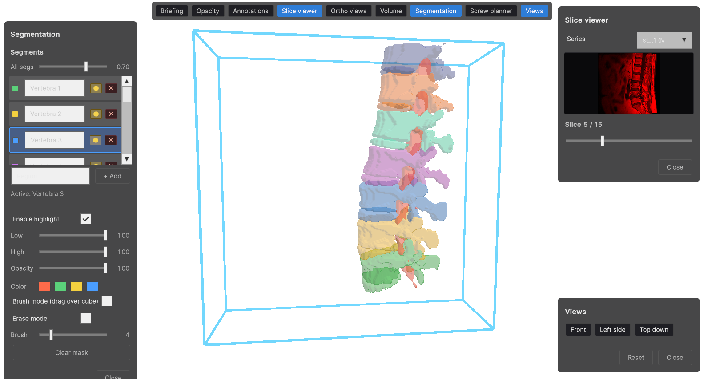
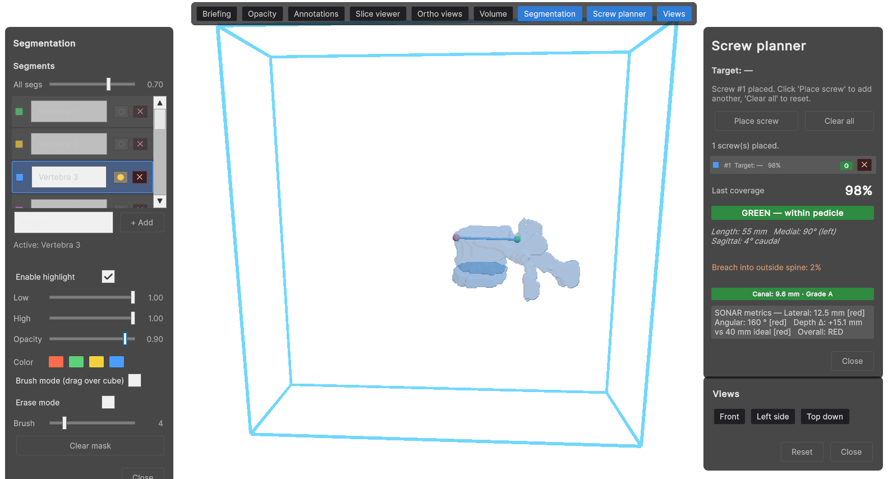
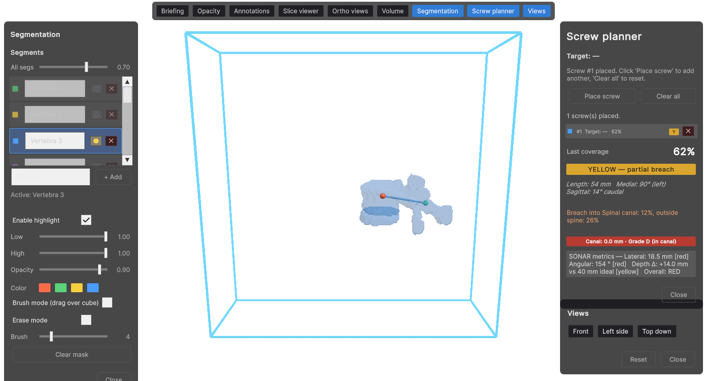
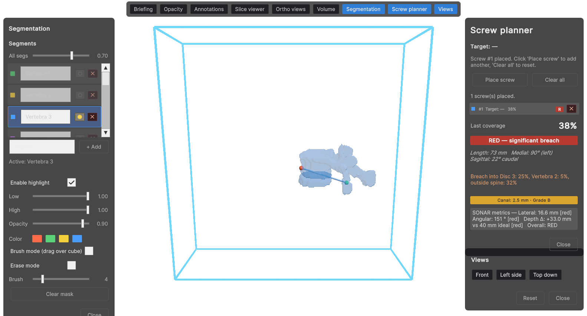
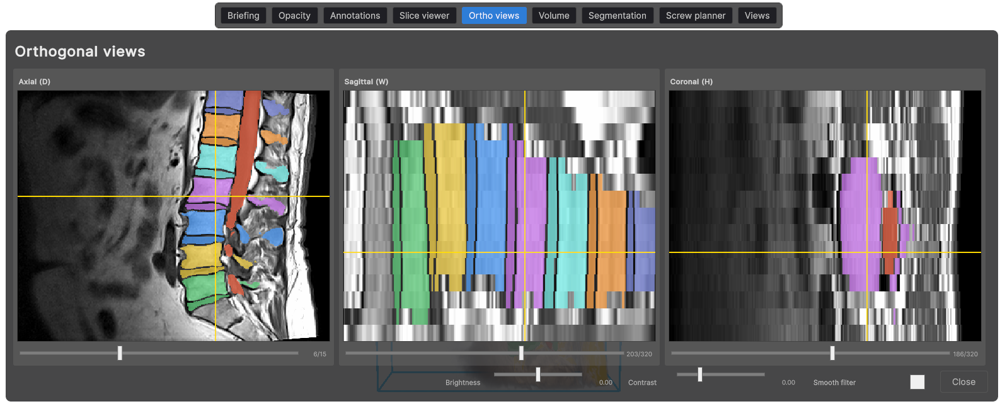

# SONAR

**S**urgical training and medical visualization platform for mixed-reality headsets.

SONAR is a Unity 6 application that brings two distinct workflows under one host shell:

1. **AR-guided surgical training** — A pedicle screw placement / bone drilling scenario on a 3D-printed phantom, with stepwise guidance, real-time skill telemetry, and participant calibration.
2. **Medical visualization** — An Imhotep-equivalent workstation for loading patient cases (DICOM volumes + segmented organ meshes), inspecting them in 3D, annotating, and saving the results.

The two scenarios share a common host: participant intake, calibration, patient data loading, panel-based UI tools, and a backend telemetry channel.



*Medical Visualization workstation — vertebra meshes from marching cubes in the centre, the Segmentation panel with per-segment list and opacity sliders on the left, and the Screw planner with four-axis scoring on the right.*

---

## Scenarios

### SONAR: Pedicle Screw Placement
AR-guided pedicle screw placement on a 3D-printed phantom.

- ArUco marker calibration with landmark touch-up
- 8-step task graph with green / yellow / red feedback
- Telemetry streamed over WebSocket to a Python backend
- Three difficulty modes: Novice, Intermediate, Expert
- Requires passthrough AR

Per-trial scoring uses three components implemented under `Assets/Scenarios/Sonar/Analytics/`:
- `PathEfficiencyScorer` — trajectory deviation from the planned path
- `SmoothnessScorer` — jerk-based motion smoothness
- `SkillScore` — aggregate participant score

After each placement the screw planner produces a worst-of-category verdict that aggregates coverage, breach, canal clearance, and trajectory deviation:

| Green — clinically acceptable | Yellow — borderline, needs supervision | Red — unsafe |
|:---:|:---:|:---:|
|  |  |  |

### Medical Visualization
Patient case workstation — Imhotep-equivalent workflow.

- Load DICOM volumes and segmented organ meshes
- 3D inspection with orthographic viewer, opacity / view controls
- Drop annotations on volumes and meshes
- Save the session state per patient



*Axial, sagittal, and coronal slices generated from the loaded MetaImage volume, with the multi-label segmentation palette overlaid and linked crosshairs marking the focal voxel shared with the 3D scene.*

---

## Tools (modular panels)

Tools live under `Assets/Tools/` and are built with Unity's UI Toolkit (UXML + USS). Each tool is its own assembly definition so scenarios can compose only what they need.

| Tool | Purpose |
|------|---------|
| `AnnotationWidget` | Drop and manage annotations |
| `DicomWidget` | DICOM series browser |
| `DicomVolumeControl` | Volume rendering parameters |
| `OpacityControl` | Per-mesh / per-volume opacity |
| `OrthoViewer` | Axial / coronal / sagittal slice views |
| `PanelToolbar` | Shared toolbar / panel docking |
| `PatientBriefing` | Patient summary view |
| `PatientSelector` | Pick a patient from the local store |
| `Screenshot` | Capture and export viewport frames |
| `ScrewPlanner` | Plan pedicle screw placements |
| `Segmentation` | Brush-based segmentation editing |
| `ViewControl` | Camera presets / view navigation |
| `Notifications` | Toast-style in-scene notifications |

---

## Host & core systems

Cross-cutting infrastructure under `Assets/Core/`:

- **App** — Cold-boot bootstrap, application lifecycle, backend WebSocket client
- **Gaze** — Eye-gaze input via OpenXR, with an editor stand-in for desktop iteration
- **Participant** — Participant identity, calibration result storage, session bookkeeping
- **Patient** — Image series abstraction, DICOM and mesh loaders
- **Registration** — ArUco-based AR registration with landmark refinement
- **Scenarios** — Scenario registry, module discovery, scene transitions
- **Settings** — User-facing app settings
- **Telemetry** — Event capture and backend transport
- **UI** — Shared screens (calibration, intake, results, settings)
- **Visualization** — Common rendering helpers

Each Sonar-specific subsystem (`Sonar.Tracking`, `Sonar.Guidance`, `Sonar.Phantom`, `Sonar.Scenario`, `Sonar.Visualization`, `Sonar.Analytics`) lives next to the scenario it serves under `Assets/Scenarios/Sonar/`.

---

## Requirements

- **Unity 6000.3.3f1** (Unity 6.3)
- **URP 17.3** (Universal Render Pipeline)
- **OpenXR 1.14** with XR Hands and XR Interaction Toolkit 3.x
- A passthrough-capable headset is required for the SONAR scenario
- A Python WebSocket backend for telemetry (separate repo)

Key Unity packages: `com.unity.xr.openxr`, `com.unity.xr.hands`, `com.unity.xr.interaction.toolkit`, `com.unity.render-pipelines.universal`, `com.unity.inputsystem`, `com.unity.nuget.newtonsoft-json`.

---

## Getting started

1. Clone the repository.
2. Open the project root in **Unity Hub** — Unity will resolve packages on first open (this takes a few minutes and regenerates the `Library/` cache).
3. Open the **Boot** scene from `Assets/Scenes/`. `ApplicationBootstrap` spawns `AppLifecycle` and transitions to `MainMenu`, from which both scenarios can be launched.
4. For the SONAR scenario, start the Python telemetry backend and ensure your headset is connected with passthrough enabled.

---

## Repository layout

```
Assets/
  Core/          Host services (app, gaze, participant, patient, registration, ...)
  Scenarios/     Scenario modules
    Sonar/        AR pedicle screw placement scenario
    MedicalViz/   Patient-case visualization scenario
    NeedleInsertion/  (in progress)
  Tools/         Reusable UI Toolkit panels
  Scenes/        Boot, MainMenu, scenario scenes
  Settings/      URP and project settings assets
  XR / XRI/      XR plugin and Interaction Toolkit settings
Packages/        Unity package manifest
ProjectSettings/ Unity project configuration
```

---

## Project context

Developed at the Faculty of Electrical Engineering, Computer Science and Information Technology Osijek (FERIT), J. J. Strossmayer University of Osijek.
